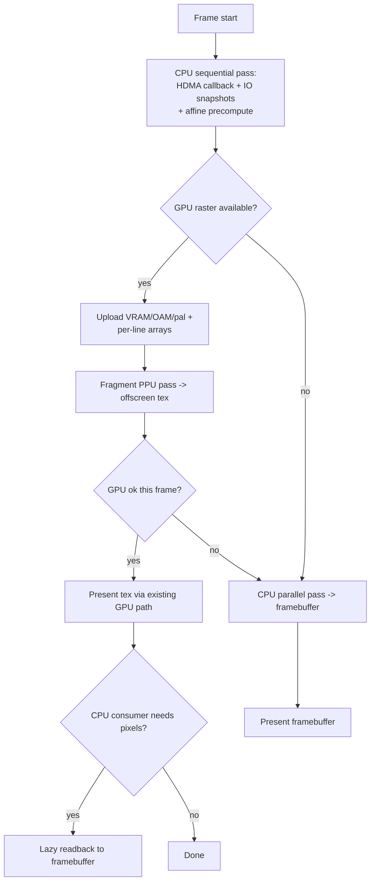

# GPU Rasterizer Design — full-PPU rendering on the GPU

**Status:** Design approved 2026-07-05. Phased implementation in progress.
**Author:** Port maintainers.
**Scope:** Move the GBA PPU *rasterization* (not just presentation) onto the GPU,
on every supported platform, with the existing software rasterizer retained as an
automatic fallback and as the byte-exact golden reference.

---

## 1. Goal

Today the GPU (`port/port_gpu_renderer.cpp`) only *presents* a framebuffer that
the CPU already rasterized in `port/ppu/src/mode1.c`. On low-end devices the
software rasterizer is 55–80% of frame time (Moto G4 profiling: 4–7 ms render vs
2–4 ms game logic). This design moves the rasterizer itself to the GPU so the CPU
is freed for game logic, and keeps the CPU rasterizer as backup/compatibility.

**Success criteria**

1. A GPU render path produces the 240×160 (or widescreen) frame from GBA
   VRAM/OAM/palette/IO, replacing `virtuappu_mode1_render_frame` for rendering.
2. Output is **bit-exact** to the CPU rasterizer where the hardware permits;
   any unavoidable driver-specific delta is documented, never silently accepted.
3. Runs on all shipping backends: Vulkan (Linux/Windows/Android) via SPIR-V,
   Metal (macOS/iOS) via MSL. No new build-time toolchain dependency.
4. GPU is the default where the device supports it; **any** GPU failure (device
   creation, pipeline build, unsupported feature, per-frame swapchain miss)
   falls back to the CPU rasterizer with no visible break.
5. Zero regression to the existing CPU byte-exact parity gate.

**Non-goals**

- Replacing the CPU rasterizer. It stays as reference + fallback, permanently.
- HLE/upscaled internal rendering beyond the existing internal-scale/xBRZ paths.
- Changing GBA rendering semantics. This is a faithful reimplementation.

---

## 2. Why this is feasible (the load-bearing insight)

The usual objection to a GPU GBA PPU is that PPU registers change **mid-frame,
per scanline** (HBlank DMA: water ripple `BGxVOFS`, `BLDY` fades, the Deepwood
rolling-barrel affine, window animation). A GPU can't run the CPU's HDMA
callback between scanlines.

But `mode1.c` **already flattened that state** to make its OpenMP pass parallel
(`virtuappu_mode1_render_frame`, `port/ppu/src/mode1.c:1396`):

1. **Sequential pass** — calls `virtuappu_mode1_pre_line_callback(line)` once per
   scanline and snapshots the full 1 KB IO register file into
   `io_snapshots[160][1024]`, plus computes `per_line_dispcnt[160]`.
2. **Affine precompute** — `virtuappu_mode1_affine_precompute` produces the
   per-line internal reference `aff_ref_x/y[160]` (the #132 latch).
3. **Parallel pass** — each scanline renders purely from its own snapshot.

That per-line-flattened state (`io_snapshots`, `per_line_dispcnt`, `aff_ref_x/y`)
is precisely the input a GPU rasterizer needs. **The hard, inherently-sequential
part already runs on the CPU and is cheap.** The GPU only needs the parallel
pass, which is embarrassingly parallel per-pixel.

Data volumes per frame are small: VRAM 96 KB (`MODE1_VRAM_SIZE` 0x18000),
BG palette 512 B, OBJ palette 512 B, OAM 1 KB, IO snapshots 160 KB raw (packed to
~a few KB of relevant registers), affine refs 160×8 B. All well within
per-frame upload budgets even on mobile.

---

## 3. Architecture

### 3.1 Approach: integer fragment-shader PPU

The GPU rasterizer is a **fragment shader** that renders a fullscreen quad into
an offscreen `R8G8B8A8_UNORM` target sized to the frame (240×160, or the
widescreen width). Each fragment computes one GBA pixel by reimplementing the
`mode1.c` composite for that `(x, line)`:

- resolve the 4 BG layers + OBJ layer for the pixel,
- apply window (win0/win1/objwin) enable masks,
- resolve priority and blend (alpha / brighten / darken) with GBA's exact 5-bit
  quantized integer math.

**Fragment, not compute**, because:

- Fragment + storage-buffer/texture reads run on GLES3-class and low-end Adreno
  where compute support is weak, missing, or driver-buggy — exactly the
  Moto-G4-tier hardware this optimization targets. Compute would raise the
  hardware floor and shrink the win's audience.
- It reuses the existing committed-SPIR-V + MSL pipeline verbatim; no compute
  pipeline framework, no new SDL_GPU surface area.

**Integer-only color path** (no float in palette/blend math) so the shader is
deterministic and matches the CPU byte-for-byte. SPIR-V/MSL integer ops are
well-defined; the risk surface is division/modulo, which we keep to
power-of-two masks/shifts as `mode1.c` already does.

Sprites are resolved per-pixel by scanning the 128 OAM entries for the topmost
covering sprite (bounded, fixed-cost: 128 tests/pixel worst case, ~4.9M/frame —
trivial for any GPU). Semi-transparent-OBJ and OBJ-window flags are produced
alongside the OBJ color so the composite can honor them, matching the CPU's
`obj_semitrans` / `obj_window` masks.

### 3.2 GPU resources

Per frame the host uploads (via `SDL_GPUTransferBuffer` → `SDL_GPUBuffer`
read-only storage buffers, or texture where a sampler helps):

| Resource            | Size / layout                              | Source |
|---------------------|--------------------------------------------|--------|
| VRAM                | 96 KB, `uint` SSBO (byte-addressed via u32)| `gVram` |
| BG palette          | 256 × u16 → packed u32 SSBO                | `gBgPltt` |
| OBJ palette         | 256 × u16 → packed u32 SSBO                | `gObjPltt` |
| OAM                 | 512 × u16 → packed u32 SSBO               | `gOamMem` |
| Per-line IO         | packed relevant regs × 160 lines, SSBO     | `io_snapshots` (subset) |
| Per-line dispcnt    | 160 × u32 SSBO                             | `per_line_dispcnt` |
| Affine refs         | 160 × (i32 x, i32 y) SSBO                  | `aff_ref_x/y` |
| Frame uniforms      | width, pitch, mode, affine flag, WS params | push/uniform buffer |

VRAM/OAM/palette come straight from the bound GBA memory
(`virtuappu_mode1_bind_gba_memory`, `port/port_ppu.cpp:751`). The per-line
arrays are produced by the **existing** CPU sequential pass — we call it, then
upload its outputs instead of running the CPU parallel pass.

Only the **relevant** IO registers per line are packed (DISPCNT, BGxCNT,
BGxHOFS/VOFS, WINxH/V, WININ/WINOUT, MOSAIC, BLDCNT/BLDALPHA/BLDY, BG2 affine
pa/pb/pc/pd + refs) — not the full 1 KB — to keep uploads tiny.

### 3.3 Output & readback

The shader renders into an offscreen GPU texture. The present path
(`Port_GPU_PresentFrame` and the existing filter passes) consumes that texture
directly — no CPU round-trip for the common on-screen case.

Some consumers still read `virtuappu_frame_buffer` on the CPU: F9 screenshot /
bug capture, shm publish, xBRZ upscaler, present-time color-correction. For
those, a **lazy readback** (`SDL_DownloadFromGPUTexture`) fills
`virtuappu_frame_buffer` only when such a consumer runs that frame. The steady
gameplay path never reads back.

### 3.4 Fallback (auto, CPU is compatibility)

`Port_GPU_Raster_Available()` is true only when: build has `TMC_GPU_RENDERER`,
the device + raster pipeline built, and required features (storage buffers in
fragment stage) are present. When false, or on any per-frame GPU error, the
frame is produced by the existing `virtuappu_mode1_render_frame` and presented
as today. The switch is per-frame and silent.

### 3.5 Cross-platform shaders

One GLSL source per shader (`port/shaders/ppu_*.frag`), compiled offline:

- **SPIR-V** via `glslangValidator` (already the project's tool), committed under
  `port/shaders/build/` — serves Vulkan on Linux/Windows/Android.
- **MSL** via `spirv-cross` run offline on that SPIR-V, committed as an `.inl`
  (extends the existing `port_gpu_msl_shaders.inl` pattern) — serves Metal.

`port/shaders/build.sh` is extended to run `spirv-cross` after `glslangValidator`
so both artifacts regenerate together. No new *build-time* dependency: the
committed blobs are the source of truth at build time, exactly like the current
filter shaders. `spirv-cross` is a dev-time tool for regenerating them.

---

## 4. Parity model

- The CPU rasterizer remains the **golden reference**. The existing
  `tools/ppu_parity_check.sh` byte-exact gate is untouched and never depends on
  the GPU.
- A **new** headless harness `tools/ppu_gpu_parity` renders the corpus frames
  through both the CPU rasterizer and the GPU rasterizer (offscreen, dummy video
  driver) and diffs the two framebuffers pixel-for-pixel.
- Target: **bit-exact**. The harness reports first-diff coordinates and a diff
  count per scene. Genuine unavoidable driver deltas are recorded in
  `docs/gpu-rasterizer-parity-notes.md` with the backend and reason; they do not
  block, but every delta must be explained.
- Each implementation phase adds its feature to the harness corpus and must reach
  bit-exact (or documented) before the phase closes.

---

## 5. Phased implementation

Each phase ends with a parity check and a smoke build; no phase ships a stub.

1. **Foundation** — GPU raster device/buffer infra behind `TMC_GPU_RENDERER`;
   upload helpers for VRAM/OAM/palette/per-line arrays; the `ppu_gpu_parity`
   harness skeleton (renders a flat/forced-blank frame both ways, asserts equal).
2. **Backgrounds** — text BG rasterization for all 4 BGs honoring per-line IO
   (scroll, char/screen base, 4bpp/8bpp, flip, 256×256/512 sizes). Parity on
   BG-only scenes.
3. **Objects** — OBJ rasterization: regular + affine sprites, 1D/2D mapping,
   4bpp/8bpp, priority, semi-transparent and OBJ-window flags. Parity on
   sprite scenes.
4. **Composite** — windows (win0/win1/objwin, WININ/WINOUT), blending
   (alpha/brighten/darken, exact 5-bit quantization), mosaic, full priority
   resolution. Parity on blend/window/mosaic scenes.
5. **Affine** — affine BG2 (GBA modes 1/2) from precomputed per-line refs +
   pa/pc, wrap/overflow. Parity on affine scenes (Deepwood barrel, minimap).
6. **PortFeatures** — widescreen Option A shadow tilemap reveal, HUD right-anchor,
   message-box centering, swamp-sink OBJ clip. Parity at width 240 and >240.
7. **Integration** — wire into the present path with per-frame auto fallback;
   lazy readback for CPU consumers; `spirv-cross` MSL generation; per-backend
   pipeline build; F8-menu + `config.json` runtime toggle (`renderer_raster =
   auto|gpu|cpu`).
8. **Verification** — cross-platform smoke (Linux Vulkan now; document
   Windows/macOS/Android build+run steps), full parity sweep, docs + changelog.

---

## 6. Files

**New**
- `port/shaders/ppu_composite.frag` (+ any helper passes) — the GPU PPU.
- `port/shaders/build/ppu_*.frag.spv` — committed SPIR-V.
- `port/port_gpu_raster.cpp` / `.h` — host side: resource upload, pipeline,
  dispatch, readback, availability/fallback. (Kept separate from the
  presentation-focused `port_gpu_renderer.cpp`.)
- `tools/ppu_gpu_parity.c` (+ xmake target) — CPU-vs-GPU diff harness.
- `docs/gpu-rasterizer-parity-notes.md` — documented deltas.

**Modified**
- `port/port_ppu.cpp` — call CPU sequential pass, then dispatch GPU raster with
  fallback; lazy readback wiring.
- `port/ppu/src/mode1.c` / `include/cpu/mode1.h` — expose the sequential
  pass outputs (IO snapshots, per-line dispcnt, affine refs) so the host can run
  "prepare-only" without the parallel render. A new
  `virtuappu_mode1_prepare_frame(...)` that does the sequential pass and returns
  the per-line arrays; `render_frame` becomes prepare + CPU parallel pass.
- `port/shaders/build.sh` — add `spirv-cross` MSL emission.
- `port/port_gpu_msl_shaders.inl` (or a new `.inl`) — generated PPU MSL.
- `xmake.lua` — new source files, new `.spv` embeds, `ppu_gpu_parity` target.
- `port/port_imgui_menu.cpp` / `port_runtime_config.*` — raster-backend toggle.

---

## 7. Risks & mitigations

| Risk | Mitigation |
|------|-----------|
| Integer div/mod nondeterminism across drivers | Use power-of-two masks/shifts only (as `mode1.c` does); harness catches any diff. |
| Fragment-stage storage buffers unsupported on an old driver | `Port_GPU_Raster_Available()` gates on the feature; CPU fallback. |
| Per-pixel 128-OAM scan too slow on weakest GPUs | Fixed, bounded cost; if measured slow, add a CPU-side per-line OBJ candidate cull uploaded as a small list (future). |
| Readback stalls on mobile tiled GPUs | Steady path never reads back; only F9/shm/xBRZ do, which are already off the hot path. |
| MSL divergence from SPIR-V | Generate MSL from the same SPIR-V via spirv-cross, not hand-translation. |
| Widescreen shadow-tilemap complexity | Phase 6 isolates it; parity tested at 240 (must stay identical) and >240. |

---

## 8. Open questions

None blocking. Deferred: whether to later add a compute-shader fast path for
high-end desktop (out of scope; fragment path is the portable baseline).
